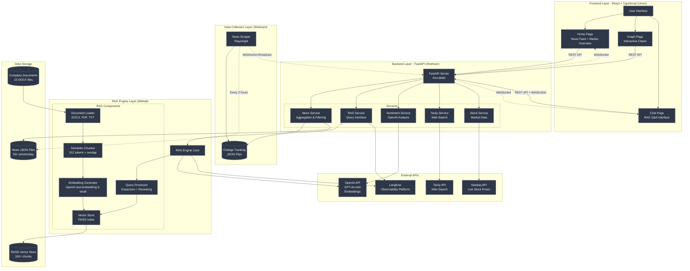
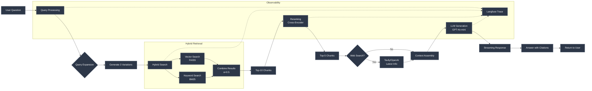
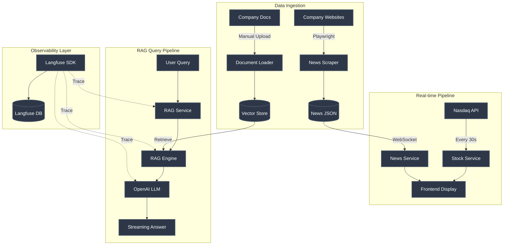
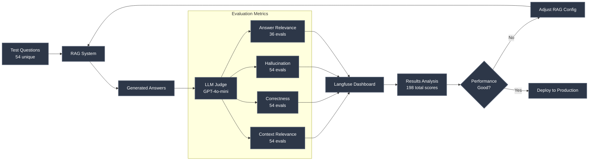
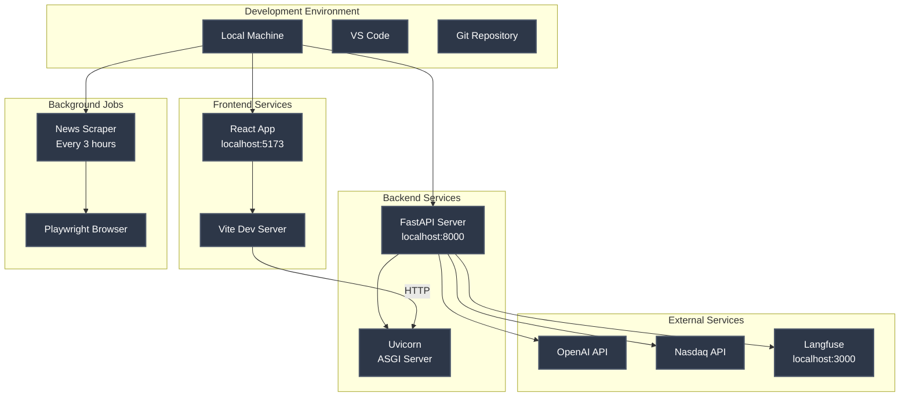
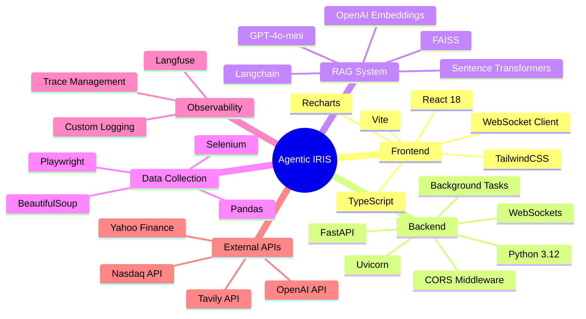

# Agentic IRIS - System Architecture Diagram

## High-Level System Architecture

## Detailed RAG Pipeline

## Data Flow Architecture

## Evaluation Framework

## Deployment Architecture

## Technology Stack Overview

---

## How to Use This Diagram

### In GitHub (Auto-renders)
Just view this file on GitHub - Mermaid diagrams render automatically!

### In VS Code
1. Install "Markdown Preview Mermaid Support" extension
2. Open this file and click "Preview" (Ctrl/Cmd + Shift + V)

### Export as Image
1. Use https://mermaid.live/
2. Copy the Mermaid code
3. Paste and export as PNG/SVG

### In Documentation
1. Copy the Mermaid code blocks
2. Paste into any Markdown file
3. Most modern viewers support Mermaid

---

## Legend

- **Blue boxes**: Frontend components
- **Yellow boxes**: Backend services
- **Green boxes**: RAG/AI components
- **Pink boxes**: Data collection
- **Purple boxes**: External APIs
- **Solid arrows**: Direct API calls
- **Dotted arrows**: Async/WebSocket/Background processes

---

**Created by:** Shehram Baig
**Date:** December 2024
**Project:** Agentic IRIS - Financial Intelligence Platform
